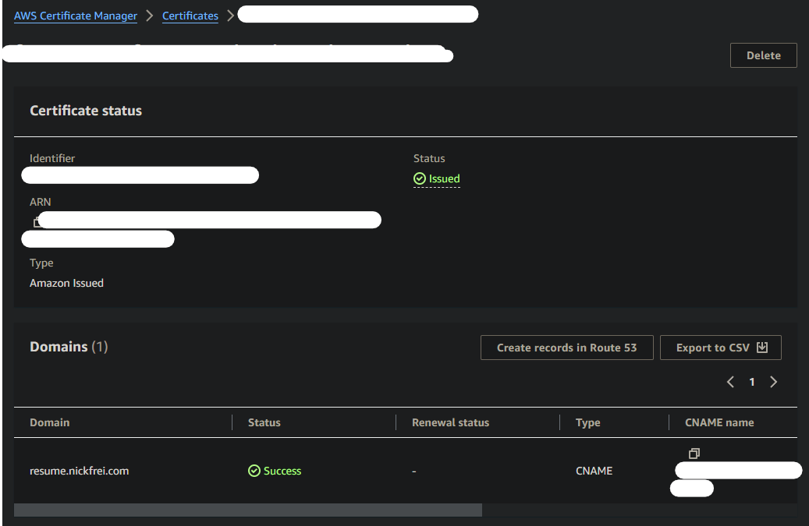
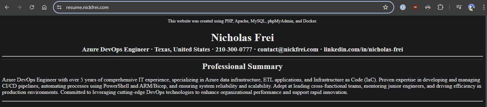

# Steps to Build Personal Resume Website Using Docker and AWS/Azure


## Prerequisite  
- Install WSL
- Docker
- Azure or AWS account
## Step 1: Create a github repo
- I created a repo called kubernetes-cloud-resume where I stored my files 
  - .gitignore file for env and sensitive files
  - PHP folder for PHP files
  - SQL for MySQL files
  - EC2 for EC2 user data script that will run when machine is created
  - docker-compose.yml for main driving script
## Step 2: Create PHP Dockerfile
  - Run `touch Dockerfile` in WSL to create the main Dockerfile
  - you might need to cd to your PHP folder `cd ./PHP`
## Step 3: Add content to the Dockerfile for the website we are creating
```
FROM php:apache
RUN docker-php-ext-install mysqli && docker-php-ext-enable mysqli && apachectl restart 
EXPOSE 80
```
The RUN cmd is to install mysqli which we will need later. This command runs on startup. It is to prevent this error `Fatal error: Uncaught Error: Call to undefined function mysqli_connect() in /var/www/html/index.php:3 Stack trace: #0 {main} thrown in /var/www/html/index.php on line 3`
- source: [Github Repo](https://github.com/vastevenson/php-docker-full-stack/blob/main/README.md)
## Step 4: Test PHP for fun
- create a PHP folder and put dockerFile and index.php in there
- update dockerFile using the code snippet
- In the index.php add a "hello world" for testing
```
FROM php:7.4-apache
COPY ./index.php ./
EXPOSE 3000
CMD [ "php", "-S", "0.0.0.0:3000" ]
```
- create docker image
```
docker build . -t nicholasfrei/personal-resume-website:v3
```
- run the docker image from WSL
```
docker run --name=resumewebsite -p=3000:3000 nicholasfrei/personal-resume-website:v3
```
- Visit the website localhost:3000


- Stop container
``` 
docker stop resumewebsite
```
## Step 5: Build out docker-compose
- Create a docker-compose.yml file
- this file will contain the containers and important settings for each container
- For this stack, we are using `php:apache, mysql, and phpmyadmin`
  - Build out compose.yml
  - adding images, volumes, and ports
- Once everything is ready, you can run the docker containers using `docker-compose up`
  - if you have an environment file (I did and it held sensitive information), you'll run `docker-compose --env-file ./dummy.env up` with dummy.env pointing to your environment file.
- Link to docker-compose.yml file: [yaml](docker-compose.yml)
## Step 5: Create SQL Tables
- All of my resume website will have a SQL backend. If you don't know SQL, I'd watch a few beginner videos or use the GUI in PHPMyAdmin to accomplish what you need. I am comfortbale with SQL, so I ran a few create table scripts and insert scripts. At the end, I ended up with these tables:
  - PersonalInformation 
  - ProfessionalSummary 
  - Experience 
  - Education 
  - Skills 
- These tables will be queried and inserted into HTML in the next portion of this project.
- I created a dummy table for your reference: [dummy table](php_sample_table.sql)
## Step 6: Create HTML for Website
- Now I worked on the HTML of my website
  - I kept the container running and went back and forth between the code/website (localhost:80) to see progress. My goal was simple: Have 5 tables in a MySQL database that I would pull dynamically into the HTML to create the "resume"
  - This took a lot of back and forth, and unfortunately, I didn't document this process well since I did this late at night. Please feel free to contact me `github (at) nickfrei (dot) com` if you have question or need help. 
- Final HTML can be found here: [HTML](./PHP/index.php)
  - This was a short project, so please excuse the lack of pretty colors and effort in the front-end.
## Step 7: Package Everything in AWS (EC2, CloudFront, Route53, and CertificateManager)
1. Login to AWS using your non-root account. If you need to create a non-root account, I highly suggest it. It is best practices to use practice of least privilege and use a non-root account when working in AWS.
### EC2
1. Once logged in, go to EC2.
   1. Launch Instance
   2. Name your EC2 instance
   3. Select Amazon Linux AMI
   4. Ensure you are on a free-tier Instance Type. I used t2.micro
   5. Create a keypair for ssh
   6. Network settings: 
      1. Allow ssh from your local public ip
      2. Allow HTTP/HTTPS from 0.0.0.0/0 (so people can access your website)
   7. Storage
      1. leave default (max is 30GiB for free tier)
   8. Advanced Details
      1. upload 'user data' script that will run on startup
      2. [User Data Script](EC2\Containers_Bash.txt)
2. Open WSL and SSH to machine
   1. You will need to change permissions on the .pem file we downloaded earlier
      1. `sudo chmod 600 EC2-personal-resume-website.pem`
   2. SSH to machine: `ssh -i ~/win_home/.ssh/EC2-personal-resume-website.pem ec2-user@<PUBLIC IP>`
      1. I use a symbolic link on in wsl "win_home" to point to my local user folder on the C: drive.
      2. You can replicate this by running this command on your machine `ln -s /mnt/c/users/<user> win_home`
3. Once SSH'd into the machine, we are going to transfer the docker-compose files to our linux machine
   1. you will need the public IP of your new EC2 instance
   2. This is the command I ran to copy these files
   ```
   scp -r -i ~/win_home/.ssh/EC2-personal-resume-website.pem ./PHP ./SQL ./docker-compose.yml ./default.env ec2-user@<PUBLIC IP>:/home/ec2-user/downloads
   ```
   3. You may need to `mkdir downloads` if you follow this exactly. The downloads folder will not be created right on creation. (side note: I did fix the containers_bash.txt script to include creating this directory when the machine is booted)
4. Now, we can run the docker-compose on the linux machine!
   1. run this command: `docker-compose --env-file ./dummy.env up`
### Certificate Manager
1. Create a new request
2. public certificate
3. Add your FQDN (i.e. resume.nickfrei.com)
4. DNS validation
5. Add tags
### Route 53
1. Add the new records to your hosted zone in AWS (route 53)
   1. this assumes you've already registered a domain and created a hosted zone in AWS. If you need help doing that, please follow this documentation: [Route53](https://aws.amazon.com/route53/)
2. After you've added the records to your hosted zone, the Certificate Manager will show a successful status
   
### CloudFront
1. Now, the easiest way to setup SSL on a personal website is to use CloudFront (when using AWS)
2. Create a new cloudfront distribution
3. Under origin domain, select the `Public IPv4 DNS` on your EC2 Instance. You may need to go back to EC2 to grab this value. 
4. Setup CloudFront with mostly default settings. I added WAF (this isn't required). 
5. Under Viewer protocol policy, I redirected all HTTP traffic to HTTPS
6. Add tags and create! 
### Finale
- After you've done all of this, and your CloudFront distribution is created, you will be able to view the EC2 instance using your FQDN. In my case, `resume.nickfrei.com`

